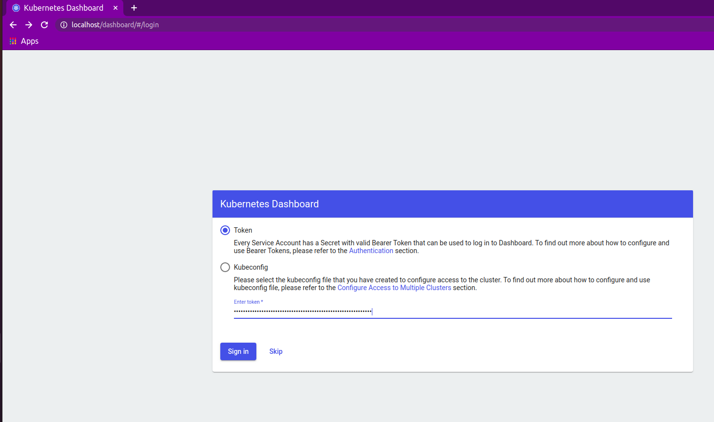
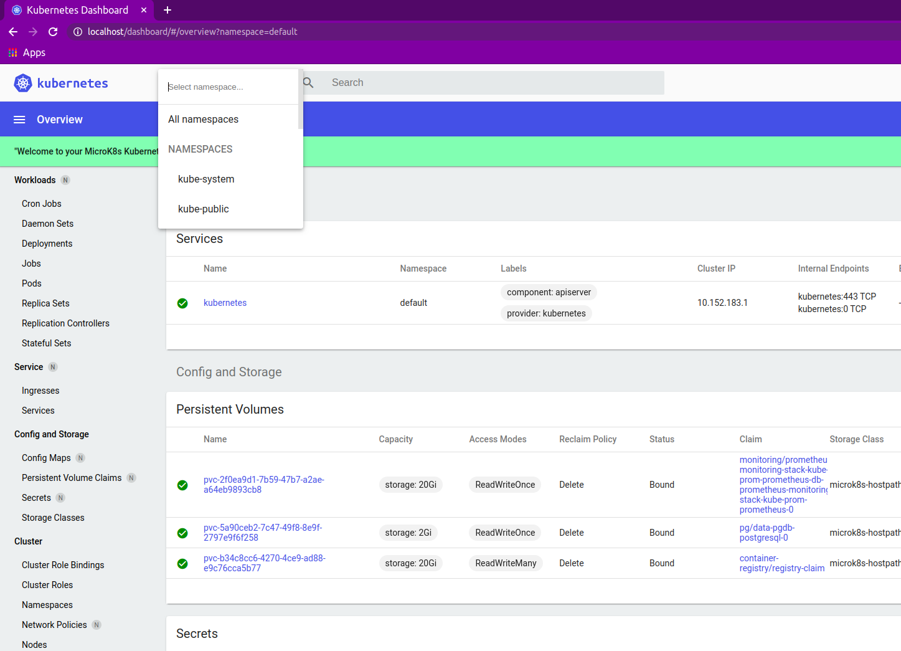

# Kubernetes Dashboard Configuration and Getting Started


The [Kubernetes dashboard](https://kubernetes.io/docs/tasks/access-application-cluster/web-ui-dashboard/) is a web-based Kubernetes UI interface. Dashboard is a web-based Kubernetes user interface. You can use Dashboard to deploy containerized applications to a Kubernetes cluster, troubleshoot your containerized application, and manage the cluster resources. You can use Dashboard to get an overview of applications running on your cluster, as well as for creating or modifying individual Kubernetes resources (such as Deployments, Jobs, DaemonSets, etc). For example, you can scale a Deployment, initiate a rolling update, restart a pod or deploy new applications using a deploy wizard.

**Side-note:**  Both [Microk8s](https://microk8s.io/docs/addon-dashboard) and [Minikube](https://kubernetes.io/docs/tutorials/hello-minikube/#create-a-minikube-cluster)  have in-built methods to install the Kubernetes dashboard; the advantage of using the helm chart as we show below is that you can configure the ingress along with your application so there is no additional port-forwarding if you are running the cluster in a remote VM. For local PC development though, the in-built dashboard invocation is very convenient.

Here is how you can install the dashboard into the cluster using the Helm chart. These instructions should work for both Microk8s and Minikube.


```bash
# the directory that contains this README file
cd kubernetes-automation-toolkit/code/k8s-common-code/k8sdashboard/
# add the helm chart repository for Kubernetes dashboard.
helm repo add kubernetes-dashboard https://kubernetes.github.io/dashboard/
helm repo update
# install the helm chart, notice we install it into the "dashboard" namespace
# the same command can be used to upgrade the helm chart at a later time as well
helm upgrade --install k8sdashboard kubernetes-dashboard/kubernetes-dashboard  -f ./dashboard-values.yaml --namespace dashboard --create-namespace
```

## Usage

Notice that the `helm` command creates the `dashboard` namespace and install Dashboard into that namespace. After you run the `helm` command as shown about, you can view the namespace contents, like so:

```
kubectl -n dashboard get all
```

The installed dashboard is hooked up to the ingress Kubernetes component (look up the "ingress" key in the dashboard-values.yaml file to see how this works). You can open the dashboard in a browser by navigating to this URL:[http://localhost/dashboard/`](http://localhost/dashboard/). You should see a screen like below:



You will need the kubeconfig file of your cluster to log into the Dashboard. The file is usually stored as `~/.kube/config`.
When you view the file you should see a section with a token in it, like so

```yaml
...
users:
- name: admin
  user:
    token: Wko0T2xkRmp1MU9asdnWitasdfZS0hqcTFrNXRyb3dXSndIbkE1WWdYWUZPN2Uvbz0K
...
```

Copy you token value and paste it into the dashboard's auth screen.

If the node running the Kubernetes cluster does not have a browser, you can use SSH port forwarding from your PC into the VM running the cluster.

You should see the Kubernetes Dashboard after successfully logging in; head over to [this documentation](https://kubernetes.io/docs/tasks/access-application-cluster/web-ui-dashboard/) to learn all the features of the Dashboard.


