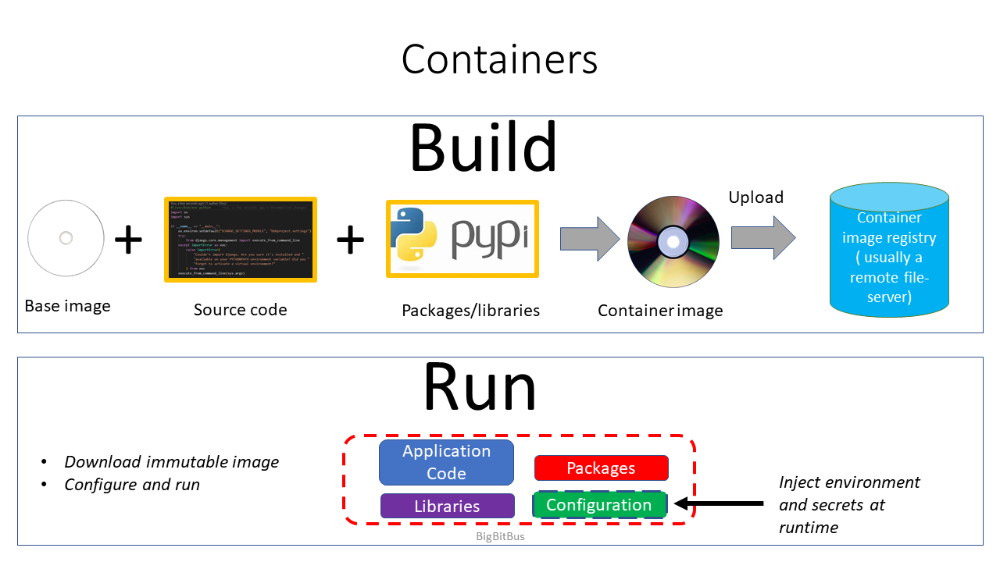
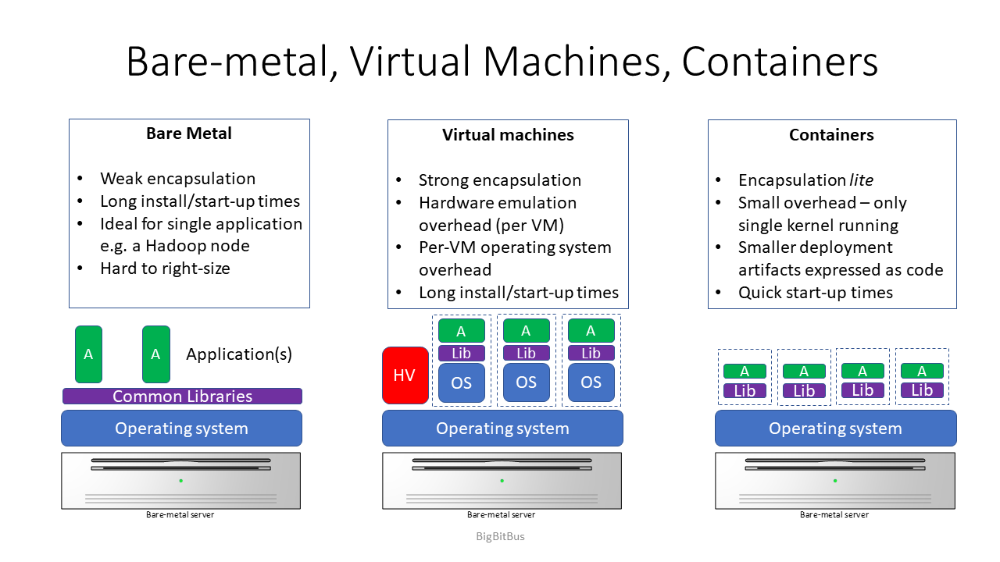
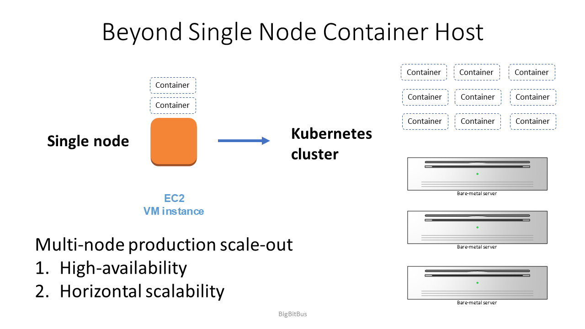
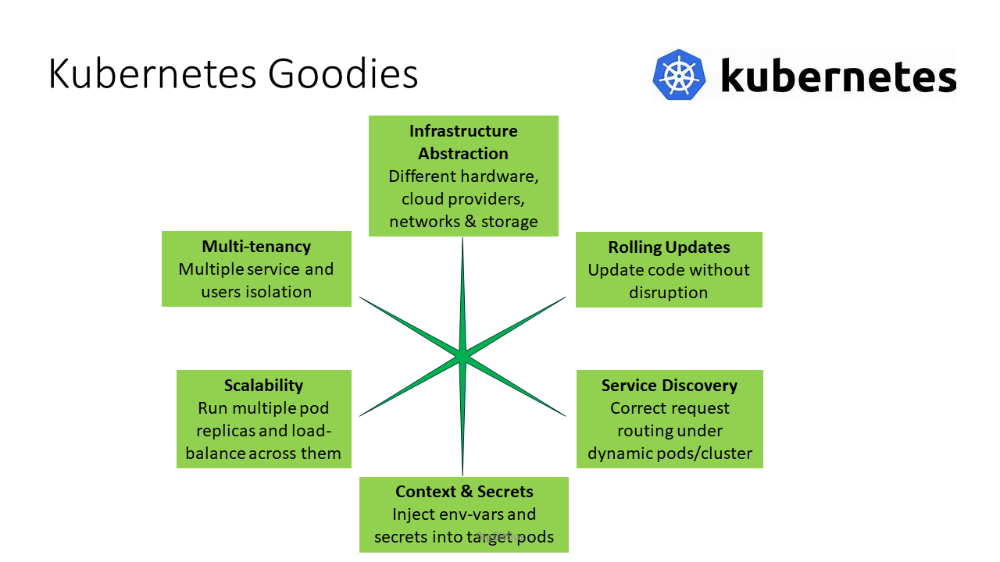
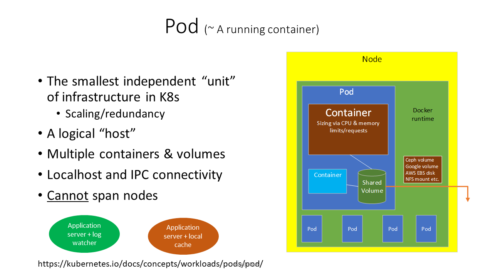
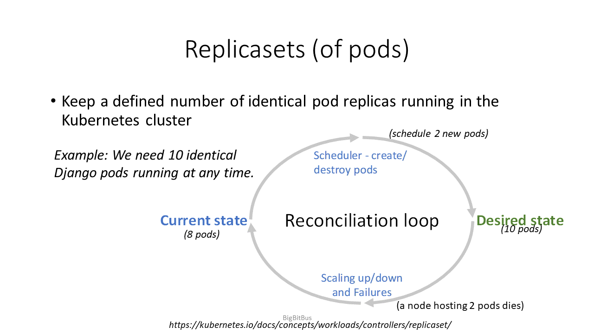
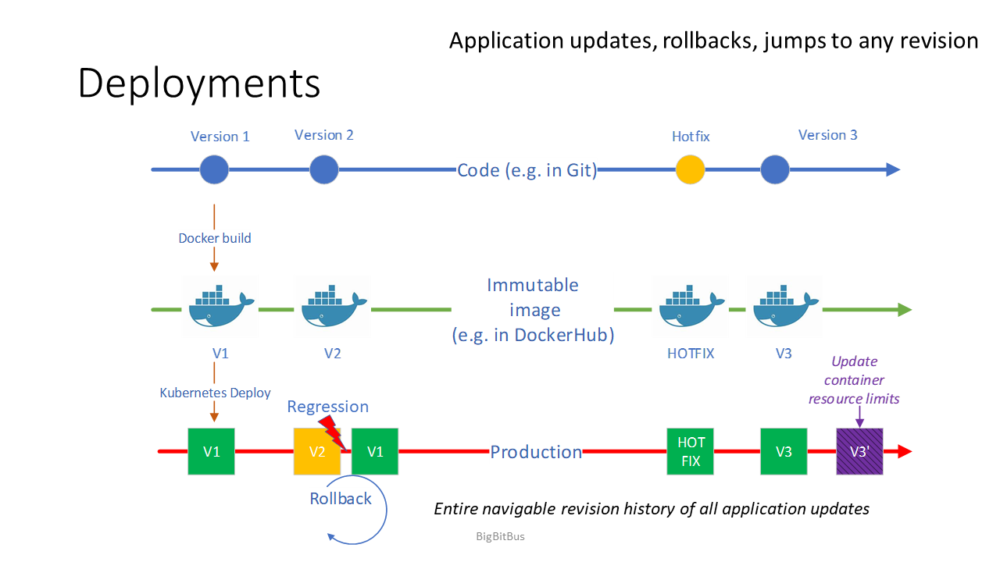
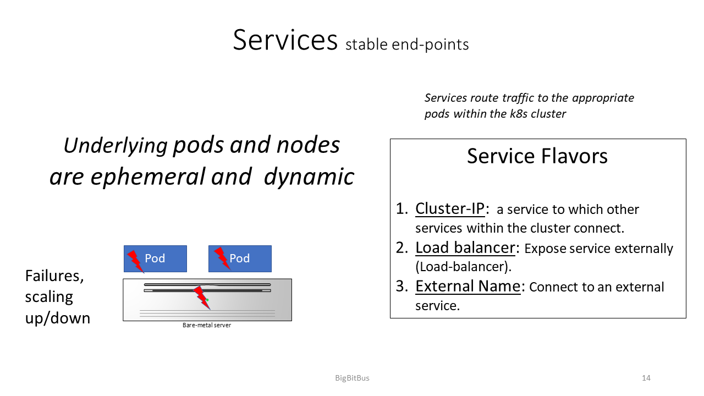

# BigBitBus KAT Documentation

**TABLE OF CONTENTS**

- [BigBitBus KAT Documentation](#kubernetes-automation-toolkit-documentation)
- [What is in the repository?](#what-is-in-the-repository)
  - [Containers](#containers)
  - [Kubernetes](#kubernetes)
    - [Pods](#pods)
    - [Application Deployments](#application-deployments)
    - [Helm](#helm)
    - [Skaffold](#skaffold)
  - [The KAT Application Example](#the-kat-application-example)
  - [Glossary](#glossary)

Welcome to the BigBitbus Kubernetes Automation Toolkit (KAT) repository.

At its heart, KAT is a series of examples of how an application can be developed and deployed into Kubernetes. The main focus is on how Kubernetes is used to host and maintain an application rather than everything Kubernetes can do. The examples in this repository include the application code, Helm charts that deploy the application, monitoring for observability, ingress (how requests are routed into the application), and considerations around how to store data within a Kubernetes cluster for the stateful aspects of the application.

Developing applications for Kubernetes needs some additional work because along with application code, infrastructure-as-code is also part of the deliverable. For example, Helm packages to deploy the application, integrations with cloud-native monitoring solutions, configuring load-balancers and application routing, managing secrets and environment variables, building rules for auto-scaling and resource management and software-defined-storage are all contained in the infrastructure-as-code that is shipped with the application code.

The documentation and code in this repository will shine light on different layers of the stack and hopefully impart enough context to navigate Kubernetes successfully for wherever your work requires - as a developer, a devops engineer, or just someone who wants to learn about the Kubernetes way of doing things. We provide links to high quality documentation for deep dives on the concepts our examples illustrate. Our examples will show you how it all comes together so you can get productive, fast. You can then choose to learn more about specific parts of the cloud native stack as your situation demands.


# What is in the repository?

We use a online to-do list application to illustrate how the API backend and single-page-application frontend are deployed into Kubernetes.

Here are some of the highlights of the KAT

1. A single-page-application written in Vuejs that lets users create a todo list.
2. An todo API written in the Django Rest Framework in Python.
3. The "state" is stored in a Postgresql database deployed on Kubernetes and a persistent volume are used to store the data on disk.
4. The application can be deployed on any Kubernetes cluster. KAT includes scripts for creating a Minikube or a Microk8s Kubernetes cluster on a single node (for example, your local PC or a virtual machine).
5. We show how Skaffold is used to invoke the helm charts that deploy the application into the Kubernetes cluster.
6. Monitoring Kubernetes health is provided through a prometheus server and grafana dashboards.
7. The Kubernetes dashboard is available to visually browse the Kubernetes cluster at any time.

We have documented several aspects of the setup. Here is where everything is:
| Category | File or Directory  | Description |
|---|---|---|
| Documentation | [README.md](./documentation/README.md) | This document. Start here for an overview and links to other documents |
| Todo Django API | [../code/app-code/api/todo-python-django](../code/app-code/api/todo-python-django) | Django Python todo backend and a detailed readme file; includes Helm chart deployed using Skaffold |
| Postgresql DB | [../code/k8s-common-code/postgres-db](../code/k8s-common-code/postgres-db) | Installing and configuring Postgresql database into the Kubernetes cluster using Helm charts |
| Vuejs Todo Single Page Application | [../code/app-code/frontend/todo-vuejs](../code/app-code/frontend/todo-vuejs) | Todo application implemented in Vuejs and a readme file; includes Helm chart deployed using Skaffold |
| Monitoring | [../code/k8s-common-code/monitoring](../code/k8s-common-code/monitoring) |Installing and configuring monitoring with Prometheus and Grafana into the Kubernetes cluster using standard Helm charts created by the Prometheus community |
| Kubernetes Dashboard | [../code/k8s-common-code/k8sdashboard](../code/k8s-common-code/k8sdashboard) | Running the Kubernetes dashboard |


We have collected and distilled short explanations of concepts below that we believe are useful to know before proceeding on your Kubernetes journey. Many of these concepts are large multi-year open-source projects in their own right with hundreds of contributors and hundreds of thousands of lines of code. So our treatment of these topics is fleeting at best, but we do strive to provide you with links to official documentation and a few other curated resources to learn more in depth if you need to.

Here is the directory tree of this repository, which gives you another view of the contents of the KAT:

```
.
├── code
│   ├── app-code
│   │   ├── api
│   │   │   └── todo-python-django
│   │   │       ├── apis
│   │   │       │   └── migrations
│   │   │       ├── config
│   │   │       ├── kubecode
│   │   │       │   └── bigbitbus-dj-py-api
│   │   │       │       └── templates
│   │   │       └── todos
│   │   │           └── migrations
│   │   └── frontend
│   │       └── todo-vuejs
│   │           ├── dist
│   │           │   └── js
│   │           ├── kubecode
│   │           │   └── bigbitbus-vue-fe
│   │           │       └── templates
│   │           ├── public
│   │           └── src
│   │               ├── assets
│   │               └── components
│   ├── k8s-common-code
│   │   ├── k8sdashboard
│   │   ├── monitoring
│   │   └── postgres-db
│   └── local-kubernetes-cluster-installation
│       ├── microk8s
│       └── minikube
└── documentation
    └── images

```

## Containers
**Fig. 1: Building container images and running containers**

Containers are like boxes. You take your application's code and all its dependencies and pack them up into a container image. This container image is then "shipped" from a developer's laptop or a build system into QA, then staging and then right up to production without change (container images are immutable, although you can inject environment variables and disk mount points into a running container). When it’s time to "run" the application, these container images become running containers - a process running on the host computer that are isolated from other containers as well as the host computer itself. Container processes can also be rate-limited in how much CPU or memory they use so that a single container cannot starve the entire host of CPU or memory. Isolation and rate-limiting is achieved by invoking the container process in namespaces and through a clever use of cgroups.

Fig. 1 shows how a container is built. We start with a base container (for example, the Python:3 container in our [API Dockerfile](../code/app-code/api/todo-python-django/Dockerfile)) and add our application code and install any libraries/dependencies into it. Then we build the immutable binary container image and push it into a container registry. A container registry is a modified file server that can host and serve these container image files.

When it is time to run the container this binary image is pulled from the registry by the container runtime (for example, Docker) and started; data volumes and configuration/environment variables are sometimes added into the container.

**Fig 2: Difference between bare metal servers, virtual machines and containers**

Compared to a virtual machine, container images are smaller because they do not contain code to run their own kernel. Instead they invoke system calls on the host kernel when they need kernel functionality - such as say, writing a file to disk. The smaller container footprint also means that they can be started and stopped much faster than a virtual machine.


Here are some further links if you are curious to learn more:

1. [Docker: What is a Container?](https://www.docker.com/resources/what-container)
2. [Redhat blog: Kernel versus User space](https://www.redhat.com/en/blog/architecting-containers-part-1-why-understanding-user-space-vs-kernel-space-matters) in the context of containers.


Now that we know how useful containers are, we want to run these in production - meaning not just on our local PC as a docker container, but across multiple nodes (hosts) as we start building highly available applications with many containers spread across multiple hosts. This is where Kubernetes comes in.

**Fig. 3: Kubernetes will orchestrate containers across multiple hosts, providing high availability and scalability for a correctly-architected application.**
## Kubernetes

Kubernetes is a system to orchestrate containers (pods) on multiple hosts (nodes). 'Orchestrate' in this context includes scheduling, running/maintaining the containers, setting up networking between containers and with the external world, managing service discovery (DNS), environment variables, secrets, storage, resource and admission control, and a whole lot of other aspects of running a highly reliable, secure application in production. The key intelligence is implemented in Kubernetes controllers, which continuously monitor the state of the deployed objects (containers, application configuration, network configuration etc.) and adjust the system toward this defined state.

<!--  -->

From an end user perspective, Kubernetes allows users to define the end-state of their applications by making HTTP API calls to the Kubernetes master API server. Users can specify the parameters of different Kubernetes objects such as pods, services, configuration maps, secrets, etc. Instead of sending API requests directly, users usually define their Kubernetes objects in Kubernetes manifest files written in yaml. The `kubectl` client can take these files and convert them into API calls which the Kubernetes API server understands. The API server in turn stores this incoming desired end-state into an `etcd` database.

 Once the user's desired end-state is available in `etcd`, Kubernetes will strive to achieve that end state for each object. This model is highly asynchronous and distributed. Objects are independently spun up from other objects. Kubernetes controllers keep watch of the cluster state for changes and attempt to maintain the end state as defined in the `etcd` database. For example, if one of the nodes in the Kubernetes cluster fails, then Kubernetes will try to recreate its pods elsewhere to maintain the number of replicas defined in replica-set objects. Similarly, if the user changes this object by sending a PUT request and now there is a new end-state, then Kubernetes will try to move to this new end state.

Take a step back and try to imagine this is happening for every object in the cluster. In addition to core Kubernetes constructs like pods and replica-sets of pods, configmaps and secrets, Kubernetes also defines standard interfaces for storage and networks. This means that vendors have the opportunity to control the end-state of an application by creating compliant drivers for their storage and networking products. Kubernetes also has a modular architecture that allows extending the Kubernetes API and functionality via [custom resource definitions (CRDs)](https://kubernetes.io/docs/concepts/extend-kubernetes/api-extension/custom-resources/) and [operators](https://kubernetes.io/docs/concepts/extend-kubernetes/operator/).

### Pods

In Kubernetes, pods encapsulate containers. Many times a pod will just be a running container and if you are beginning your Kubernetes journey then think of a pod and container as interchangeable for the most part. A pod runs within a worker "Node" in a Kubernetes cluster. Pods can sometimes contain multiple containers and share data volumes, network interfaces as well as the port-range between the multiple containers. One of the key architectural differences between pods and say, virtual machines running the application is that pods are dispensible and should be treated as ephemeral. For example,they can be restart and even rescheduled by Kubernetes on a different node unless a user [explicitly constrains](https://kubernetes.io/docs/concepts/scheduling-eviction/taint-and-toleration/) the Kubernetes scheduler not to do so.
**Fig. 4: A Kubernetes Pod**

Fig. 4 shows a Kubernetes pod. A pod runs within a worker node and is the smallest independent unit of infrastructure. It may have multiple containers that share the same network and volumes. Data volumes are usually provided through remote storage (Ceph/EBS volumes etc.) so that when a pod is re-provisioned on another node the same storage volume can become available to it. Pods can span multiple CPU cores with the the node but they cannot span nodes.

### Application Deployments
Although you can run your application as a single pod within Kubernetes, ideally you would want to deploy your application so that there are multiple pods running the same application code on different nodes. This helps with reliability (a pod failure) and scalability (multiple application serving pods).

A set of identical pods is called a replica-set. The Kubernetes replica-set controller constantly checks if the number of running replicas is equal to the user-defined manifest for this replica set; if not then the Kubernetes scheduler will start new pods to reconcile the difference. This "reconciliation loop" to achieve the desired state, as illustrated in Fig. 5, is at the heart of how Kubernetes works. Similar reconciliation controllers are continiously monitoring the `etcd` database for changes to other Kubernetes objects as well, and will strive toward moving the cluster toward the desired state.
**Fig 5: Replica-sets of Pods**


Kubernetes provides users with the ability to deploy newer versions of their code - for example a developer can deploy a newer container image containing more recent code. A [deployment](https://kubernetes.io/docs/concepts/workloads/controllers/deployment/) object is created which has the ability to roll-back in case the new version has a regression. In the figure below developers are creating new code and storing it in [Git](https://git-scm.com/). When it is time to release the code, an immutable container image is built and stored in the container image registry from the code release candidate. This image is used to deploy the code into QA, staging and finally production.


 **Fig 6: Developer workflow and how it maps into Kubernetes Deployments**

Kubernetes stores a history (previous versions of the application) of replica sets which can be rolled back as needed using a single command. This is very powerful and gives developers the confidence to iterate quickly and ship faster.

Fig 6 illustrates these concepts. Developers use source code management (for example Git) to  tag different software release versions. These software code releases will be inserted into container images and stored as an immutable image in a container registry as we saw in Fig.1. There may be intermediate steps of running QA against these release candidates. Next, the developer or operations engineer will update the deployment definition and change its container image version (container images are usually tagged for identifying versions). They apply the changed Kubernetes yaml manifest using the `kubectl` tool to the API server which in turn changes the `etcd` definition of the deployment object.

 Kubernetes deployment controllers notice the changed image tag and create a new replica-set for this image. Once the replica-set is 'populated' and pods are successfully deployed, the older replica-set is deleted and its pods destroyed. Its "definition" is preserved, so that a user may roll-back to an earlier version if they so desire.

Finally, we come to the question of service discovery. Pods are ephemeral in Kubernetes and should not be directly addressed by other microservices or external clients. Instead, [services](https://kubernetes.io/docs/concepts/services-networking/service/) are created to provide stable endpoints. Services have two important capabilities:
  1. Kubernetes services have well-defined fixed IPs, and  Kubernetes can run an internal DNS service for service discovery. This is irrespective of the pods implementing the service that are ephemeral.
  2. Services can load-balance traffic across different pods. This is key to scaling applications by running more pods in Kubernetes and having the service automatically load-balance requests across all the pods.

**Fig 6: Kubernetes Services**

Fig 6. shows that unlike pods, service provide stable endpoints. There are different types of services in Kubernetes, such as Cluster-IP, Load balancer, Nodeport or external name. We encourage readers to spend time with the [official services documentation](https://kubernetes.io/docs/concepts/services-networking/service/) as this is vital to get the application architecture right.


### Helm

When we want to install a software or application in Kubernetes it usually needs to create multiple Kubernetes objects. For example:
  - Pods running the code or binary application
  - Services that allow the application's components to communicate with each other or to users
  - Environment variables and secrets for the application
  - Kubernetes constructs like deployments or replicasets that define the scope and size of an application
  - ...and many more

Helm charts contain templated Kubernetes manifests (yaml files) that can be populated with values a user chooses to craft her/his Kubernetes deployment of the application. For example, one user may want to create 2 replicas of a Pod whereas another may want to create 10 replicas, or perhaps one user may want to use one container image version of the software versus another who wants to use another version.

A `values.yaml` file,  specified when installing a Helm chart, specifies these parameters and its values get substituted in the template to create Kubernetes manifests. The convention of supplying a generic "works-out-of-the-box" `values.yaml` file with the Helm chart's source code helps users get started while creating their own customizations; there are also sane defaults in good Helm charts, so users only need to change values they care about.

These Kubernetes manifests are then applied to the Kubernetes cluster (meaning, they are `translated` into json and posted to the Kubernetes API server, which then acts upon the configuration defined by the manifests).

Helm charts are like "software packages'', usually created by the creator or someone knowledgeable about the application. They are created by writing up the Kubernetes manifest and then "templating out" any relevant parameters in a `values.yaml` file. When the end user wants to use this Helm chart, their Helm client downloads it from a repository and the user simply substitutes an appropriate `values.yaml` file to adapt the Kubernetes manifests being generated by the chart to her/his needs. The neat thing about a Helm “package" is that it is all plain-text and easily understandable as it uses the Golang templating language. In fact pro-Kubernetes users sometimes download the Kubernetes chart and make their own tweaks to the template files. It's really not that hard to do once you have understood the basics of how templating works.

Perhaps you want to write our own Helm chart for your own application or for some open-source software you know. Start [here](https://v2.helm.sh/docs/developing_charts/) to learn more about how to set up boilerplate code to get started.

### Skaffold

[Skaffold](https://skaffold.dev/) is an command line build tool for developers for Kubernetes applications developed by Google. It aims to handle the workflow for building, pushing, and deploying an application. This enables developers to focus more on developing instead of building and deploying. Skaffold deployments are based around a [skaffold.yaml](../code/app-code/api/todo-python-django/skaffold.yml) file which contains information such as the docker image to use when building the container, path to the application, target environment to deploy it into etc. Running this file will allow skaffold to watch a local application directory for changes in which upon change, will automatically build, push and deploy to a local or remote Kubernetes cluster.

For the KAT examples, skaffold allows us to develop the Django backend and Vue.js frontend without having to use time on deployment configurations such as Kubernetes manifest files or rebuilding images. A quick `skaffold run` builds the application and deploys it within the Kubernetes cluster and tracks it for change.

## The KAT Application Example

Now that we have a high level idea of some of the features of Kubernetes, lets visualize what the KAT project code will build inside our Kubernetes cluster. The figure below visually depicts our Kubernetes cluster (installed with Microk8s) with our todo application and monitoring deployed within. We have labelled the components inside the image and here is a summary of each:


**Fig. 7: KAT Todo Application Stack and Supporting Services in Kubernetes**

| Label | Description | Exploratory commands | Link to Code|
| ----- | ----------- | ------------ | ----- |
| 1(a) | The backend todo API Kubernetes service. This is load-balancing all requests coming to the `/djangoapi/` endpoint to two backend pods in this picture. This service is of type ClusterIP.  | `kubectl -n be describe service` | [API service template in Helm chart](../code/app-code/api/todo-python-django/kubecode/bigbitbus-dj-py-api/templates/service.yaml) |
| 1(b) | The backend todo API deployment has created a replicaset which in turn has defined two pods for the Django API. | `kubectl -n be get po -o wide` | [API deployment template in Helm chart](../code/app-code/api/todo-python-django/kubecode/bigbitbus-dj-py-api/templates/deployment.yaml) |
| 2(a) | The todo database service. Note this is an "interal" ClusterIP service and that the Django API pods 1(b) connect to this service exposing port 5432. | `kubectl -n pg describe svc` | [Postgres helm chart](https://github.com/bitnami/charts/tree/master/bitnami/postgresql/), [KAT postgres values file](../code/k8s-common-code/postgres-db/pg-values.yaml) |
| 2(b) | The postgres database pod. This pod creates uses a persistent volume to persist the database. | `kubectl -n pg describe po` | [Postgres helm chart](https://github.com/bitnami/charts/tree/master/bitnami/postgresql/), [KAT postgres values file](../code/k8s-common-code/postgres-db/pg-values.yaml) |
| 3(a) | The frontend Vuejs single-page application todo service, This is setup to load-balance requests on the `/frontend/` endpoint to two frontend pods serving the Vuejs files in this picture. The service is of type ClusterIP. | `kubectl -n fe describe svc`  | [Frontend service template](..code/app-code/frontend/todo-vuejs/kubecode/bigbitbus-vue-fe/templates/service.yaml) used to render a Kubernetes yaml manifest based on the values passed into helm. |
| 3(b) | The frontend pods - these are nginx pods that serve up the Vuejs code files. This is a stateless application since its not connected to the backend API; the client loads up the application on their browser and then directly talks to the backend API at `/djangoapi/` | `kubectl -n fe describe deploy`; `kubectl -n fe get po -o wide` | [Frontend service template](..code/app-code/frontend/todo-vuejs/kubecode/bigbitbus-vue-fe/templates/service.yaml) used to render a Kubernetes yaml manifest based on the values passed into helm. |
| 4(a) | The Kubernetes dashboard service; this forwards requests coming to `/dashboard/` into the dashboard pod. | `kubectl -n dashboard describe svc`; `kubectl -n dashboard describe endpoints` | [Dashboard helm chart](https://github.com/kubernetes/dashboard/tree/master/aio/deploy/helm-chart/kubernetes-dashboard); [KAT Dashboard values file](../code/k8s-common-code/k8sdashboard/dashboard-values.yaml) |
| 4(b) | The Kubernetes dashboard pod, notice its not replicated - so its not a highly available server | `kubectl -n dashboard describe po` |  [Dashboard helm chart](https://github.com/kubernetes/dashboard/tree/master/aio/deploy/helm-chart/kubernetes-dashboard); [KAT Dashboard values file](../code/k8s-common-code/k8sdashboard/dashboard-values.yaml) |
| 5(a) | The Grafana dashboard service. | `kubectl -n monitoring describe service grafana` | [The Prometheus  stack Helm chart](https://github.com/prometheus-community/helm-charts/tree/main/charts/kube-prometheus-stack), [KAT prometheus stack values file for Helm](../code/k8s-common-code/monitoring/prometheus-grafana-monitoring-stack-values.yaml). |
| 5(b) | The Grafana pod | `kubectl -n monitoring describe po grafana` | [The Prometheus  stack Helm chart](https://github.com/prometheus-community/helm-charts/tree/main/charts/kube-prometheus-stack), [KAT prometheus stack values file for Helm](../code/k8s-common-code/monitoring/prometheus-grafana-monitoring-stack-values.yaml). |
| 6(a) | The Prometheus time-series metrics server service, note its not exposed externally via the Ingress but is an internal service consumed by Grafana. | `kubectl -n monitoring describe pod prometheus-server` | [The Prometheus  stack Helm chart](https://github.com/prometheus-community/helm-charts/tree/main/charts/kube-prometheus-stack), [KAT prometheus stack values file for Helm](../code/k8s-common-code/monitoring/prometheus-grafana-monitoring-stack-values.yaml). |
| 6(b) | The prometheus server pod, note it uses a persistent volume to store the metrics | `kubectl -n monitoring get po -o wide`; `kubectl get pv`; `kubectl -n monitoring get pvc` | [The Prometheus  stack Helm chart](https://github.com/prometheus-community/helm-charts/tree/main/charts/kube-prometheus-stack), [KAT prometheus stack values file for Helm](../code/k8s-common-code/monitoring/prometheus-grafana-monitoring-stack-values.yaml). |
| 7 | The ingress. This is where all HTTP requests enter the Kubernetes cluster and are appropriately routed into `/frontend`, `/djangoapi`, `/dashboard/` or `/monitoring-grafana`. This is also where you would terminate SSL in production and/or interface with your cloud provider's load balancer, so ingress is a very important aspect of| `kubectl get ingress --all-namespaces -o wide` |  [Nginx Ingress documentation](https://kubernetes.github.io/ingress-nginx/) |


<hr>


Its time to head over to the code and documentation for the individual components! Or, if you want to deploy everything and see how the whole example works, head over to our [quickstart with Vagrant](./quickstart-vagrant.md).

## Glossary

* [Helm](https://helm.sh/): A package manager for Kubernetes

* [Skaffold](https://skaffold.dev/): An automated build tool for Kubernetes

* [Kubernetes](https://kubernetes.io/): An open-source container-orchestration system for automating computer application deployment, scaling, and management

* [Django](https://www.djangoproject.com/): Python-based free and open-source web framework

* [Vue](https://vuejs.org/): An open-source front end JavaScript framework for building user interfaces and single-page applications

* [Prometheus](https://prometheus.io/): Kubernetes monitoring tool

* [Grafana](https://grafana.com/): Observisibility dashboarding and logging tool

* [PostgreSQL](https://www.postgresql.org/): An open-source relational database management system

* [Microk8s](https://microk8s.io/): A lightweight, production-ready Kubernetes distribution

* [Minikube](https://kubernetes.io/docs/tasks/tools/#:~:text=Like%20kind%20%2C%20minikube%20is%20a,or%20for%20daily%20development%20work.): A tool that lets you run Kubernetes locally

* [Node](https://kubernetes.io/docs/tutorials/kubernetes-basics/explore/explore-intro/#:~:text=A%20Node%20is%20a%20worker,the%20Nodes%20in%20the%20cluster.): A worker machine in Kubernetes. May be either virtual or physical.

* [Pod](https://kubernetes.io/docs/concepts/workloads/pods/): Smallest deployable units of computing in Kubernetes that are used to run a node(s)


