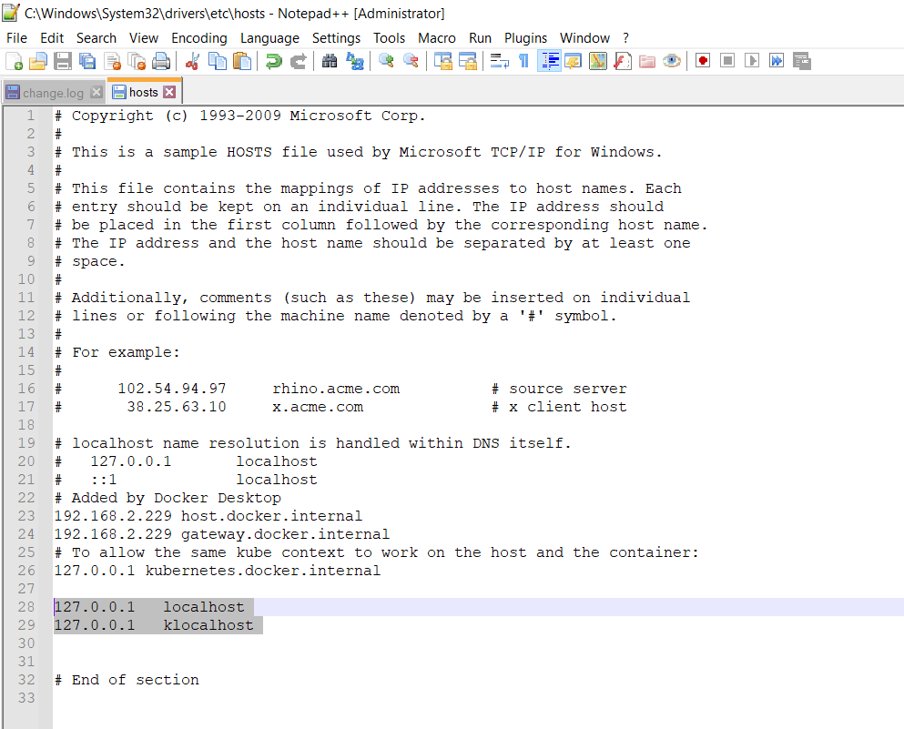

### Connect to Cloud VM from your Local Windows Machine using Port Forwarding Technique.

Requirements:
- Putty

### Steps

1. Nagivate to C:\Windows\System32\drivers\etc

2. Open the `host` file by right clicking and editing with either a text editor or notepad.


3. Add these lines to the `host` file:
```
127.0.0.1	localhost
127.0.0.1 klocalhost
```


4. Open Putty. Here you will need to create a session. Under `Host Name (or IP address)` supply your [username]@[IP of VM] with Port 22.


5. On the left-hand navigation bar, expand `SSH` and click on `Auth`. Supply your SSH key you used to create the VM.


6. Open up `Tunnels` below `SSH` and add:
`Source Port: 80   Destination: klocalhost:80`
`Source Port: 8080   Destination: localhost:80`


7. Save your session as you may need/want to reuse it.

8. After saving the session, you can now `load` it and `open` which will connect you to the VM.
