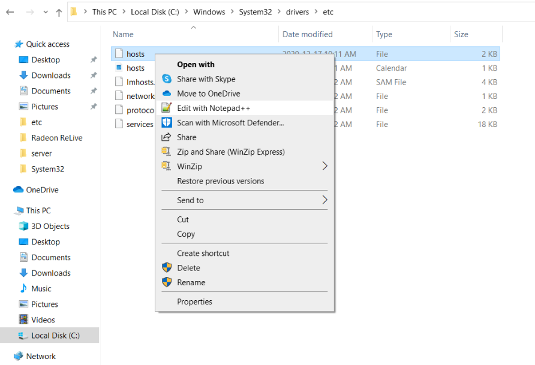
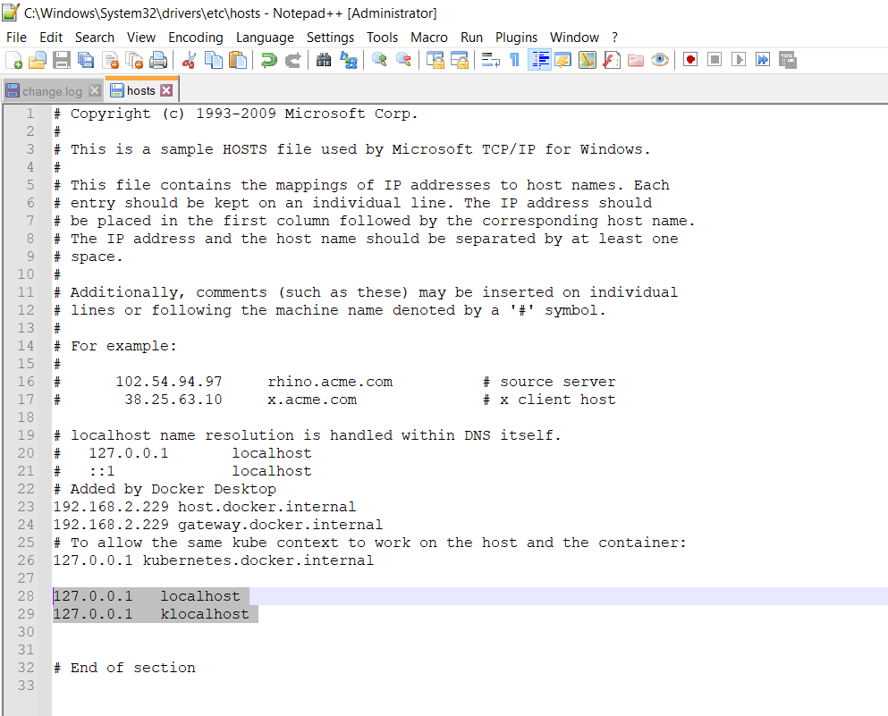
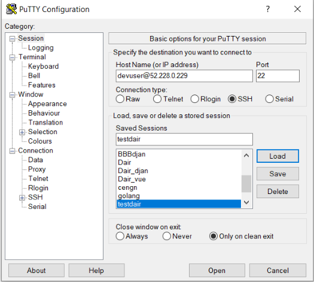
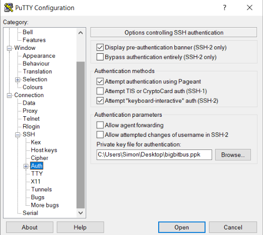

### This README goes over the steps needed to connect to the cloud VM and display the KAT example on your local Windows machine. You don't need this if you used Vagrant on your local machine.

Requirements:
- Putty

### Steps

1. Nagivate to C:\Windows\System32\drivers\etc

2. Open the `host` file by right clicking and editing with either a text editor or notepad.


3. Add these lines to the `host` file:
```
127.0.0.1	localhost
127.0.0.1 klocalhost
```


4. Open Putty. Here you will need to create a session. Under `Host Name (or IP address)` supply your [username]@[IP of VM] with Port 22.


5. On the left-hand navigation bar, expand `SSH` and click on `Auth`. Supply your SSH key you used to create the VM.


6. Open up `Tunnels` below `SSH` and add:
`Source Port: 80   Destination: klocalhost:80`
`Source Port: 8080   Destination: localhost:80`


7. Save your session as you may need/want to reuse it.

8. After saving the session, you can now `load` it and `open` which will connect you to the VM.
